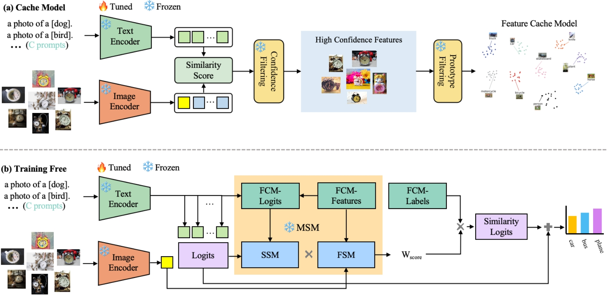

# TFUP

> **Training-Free Unsupervised Prompt for Vision-Language Models**

Prompt learning has become the most effective paradigm for adapting large pre-trained vision-language models (VLMs) to downstream tasks. Recently, unsupervised prompt tuning methods, such as UPL and POUF, directly leverage pseudo-labels as supervisory information to fine-tune additional adaptation modules on unlabeled data. However, inaccurate pseudo-labels easily misguide the tuning process and result in poor representation capabilities. In light of this, we propose Training-Free Unsupervised Prompts (TFUP), which maximally preserves the inherent representation capabilities and enhances them with a residual connection to similarity-based prediction probabilities in a training-free and labeling-free manner. Specifically, we integrate both instance confidence and prototype scores to select representative samples, which are used to customize a reliable Feature Cache Model (FCM) for training-free inference. Then, we design a Multi-level Similarity Measure (MSM)
that considers both feature-level and semantic-level similarities to calculate the distance between each test image and the cached sample as the weight of the corresponding cached label to generate similarity-based prediction probabilities. In this way, TFUP achieves
surprising performance, even surpassing the training-base method on multiple classification datasets. Based on our TFUP, we propose a training-based approach (TFUP-T) to further boost the adaptation
performance. In addition to the standard cross-entropy loss, TFUP-T adopts an additional marginal distribution entropy loss to constrain
the model from a global perspective. Our TFUP-T achieves new state-of-the-art classification performance compared to unsupervised and few-shot adaptation approaches on multiple benchmarks.
In particular, TFUP-T improves the classification accuracy of POUF by 3.3% on the most challenging Domain-Net dataset.




## Model Zoo

Unsupervised Learning Classification Task On DomainNet

| Dataset/Domain       | TFUP Acc. | TFUP-T Acc. | Log/TFUP                                      | Log/TFUP-T                                        |
|----------------------|-----------|-------------|-----------------------------------------------|---------------------------------------------------|
| DomainNet/clipart    | 73.9      | 76.0        | [Link](TFUP_logs/domainnet_clipart_log.txt)   | [Link](TFUP-T_logs/domainnet_clipart_log.txt)     |
| DomainNet/infograph  | 52.9      | 54.7        | [Link](TFUP_logs/domainnet_infograph_log.txt) | [Link](TFUP-T_logs/domainnet_infograph_log.txt)   |
| DomainNet/painting   | 69.2      | 72.1        | [Link](TFUP_logs/domainnet_painting_log.txt)  | [Link](TFUP-T_logs/domainnet_painting_log.txt)    |
| DomainNet/quickdraw  | 17.8      | 24.6        | [Link](TFUP_logs/domainnet_quickdraw_log.txt) | [Link](TFUP-T_logs/domainnet_quickdraw_log.txt)   |
| DomainNet/real       | 85.2      | 85.8        | [Link](TFUP_logs/domainnet_real_log.txt)      | [Link](TFUP-T_logs/domainnet_real_log.txt)        |
| DomainNet/sketch     | 66.1      | 67.9        | [Link](TFUP_logs/domainnet_sketch_log.txt)    | [Link](TFUP-T_logs/domainnet_sketch_log.txt)      |
| Average              | 60.9      | 63.5        |                                               |                                                   |


## How to Install

This code is built on top of the awesome toolbox [Dassl.pytorch](https://github.com/KaiyangZhou/Dassl.pytorch) so you need to install the `dassl` environment first. Simply follow the instructions described [here](https://github.com/KaiyangZhou/Dassl.pytorch#installation) to install `dassl` as well as PyTorch. After that, run `pip install -r requirements.txt` under `TFUP-main/` to install a few more packages (this should be done when `dassl` is activated). Then, you are ready to go.

## Dataset
Follow [DATASET.md](DATASETS.md) to install Office-Home, Office31, VisDA17 and DomainNet.

## How to Run

### Unsupervised Learning

Before running, you should make changes to the config files in `configs`: `DATASET.ROOT`.

#### Training Free

Below we provide an example on how to run on Office-Home/art.

```bash
python main.py --config configs/office_home.yaml --domain_name art
```

If you want to run on other datasets, replace `office_home` with `office31`, `visda17` or `domainnet` and make changes to the `domain_name`. 

#### Training

```bash
python main.py --config configs/office_home.yaml --domain_name art --training
```

After training, the adapters and cache model can be found in `cache_dir/OfficeHome/art`.

#### Inference

```bash
python main.py --config configs/office_home.yaml --domain_name art --eval-only
```


# Acknowledgement
We would like to thank the authors of [POUF]( https://github.com/korawat-tanwisuth/POUF), [APE]( https://github.com/yangyangyang127/APE), [Tip-Adapter](https://github.com/gaopengcuhk/Tip-Adapter) and [CoOp](https://github.com/KaiyangZhou/CoOp), based on which this codebase was built.

